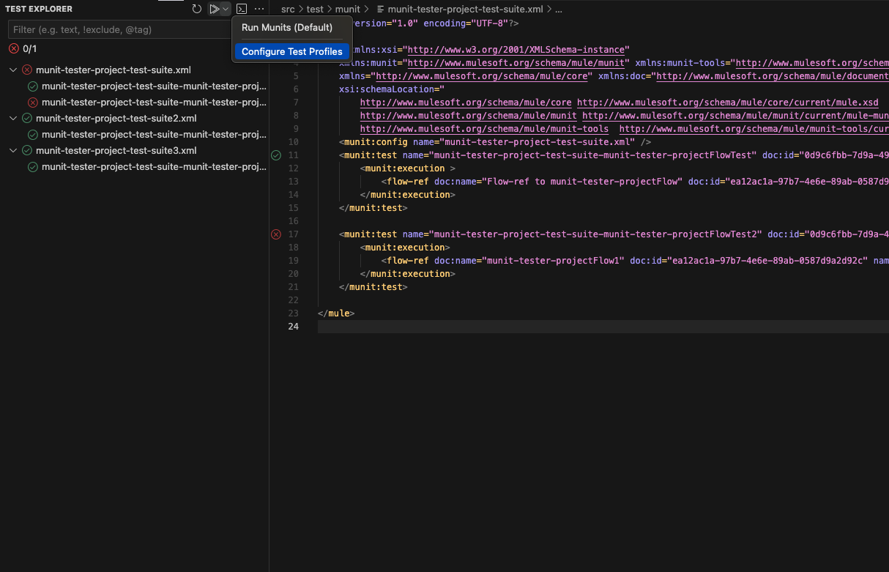
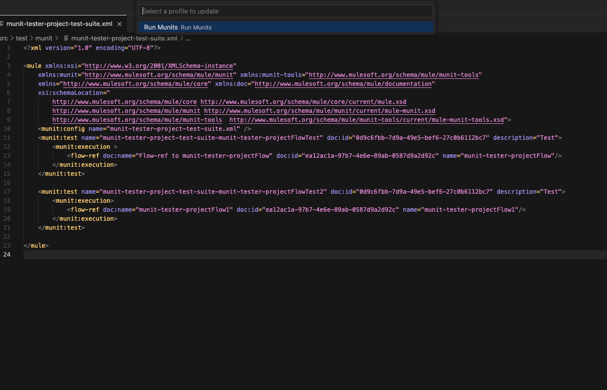
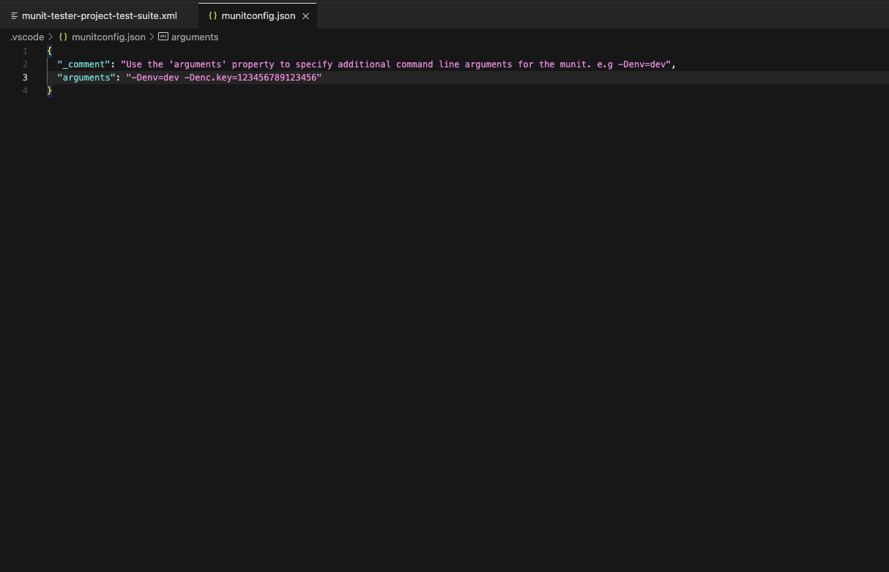
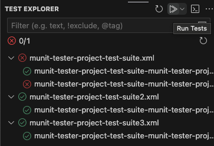

# MUnit Launcher

With this extension, you can easily run and manage your MUnit tests directly within the VS Code

## Features

- **Run MUnit Tests**: Launch MUnit tests directly from the VS Code

- **Configure Launch Arguments**

- **Launch all Tests**

## Requirements

Before you can use this extension, ensure you have the following installed:
- MuleSoft Anypoint Studio and MUnit
- Java JDK 8 or later
- Maven
    - To fetch nexus repo you have to update m2 file

## Future plans
- Add code coverage 

## Known Issues

For any known issues, please refer to the [issues section](https://github.com/DasArthur/vs-code-ext-mule-munit-helper) of our GitHub repository.

---

**Enjoy testing with MUnit on VS Code!**