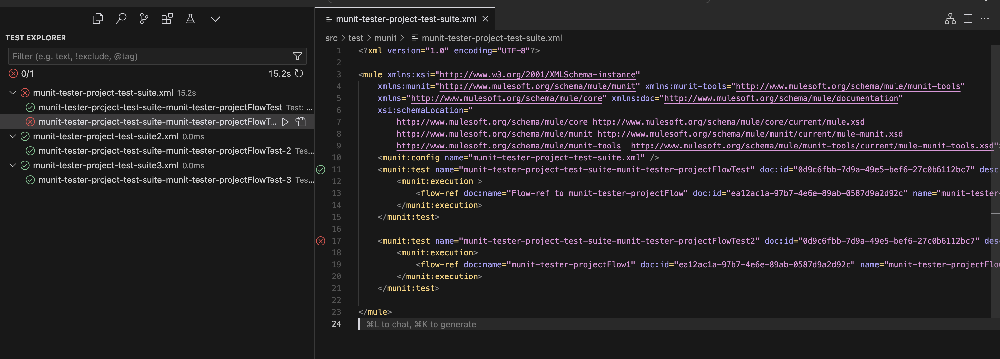

# vs-code-ext-mule-munit-helper README

With this extension, you can easily run and manage your MUnit tests directly within the VS Code environment.

## Features

- **Run MUnit Tests**: Launch MUnit tests directly from the VS Code command palette 

## Requirements

Before you can use this extension, ensure you have the following installed:
- MuleSoft Anypoint Studio and MUnit
- Java JDK 8 or later
- Maven

## Known Issues

For any known issues, please refer to the [issues section](https://github.com/your-username/vs-code-ext-mule-munit-helper/issues) of our GitHub repository.

---

**Enjoy testing with MUnit on VS Code!**